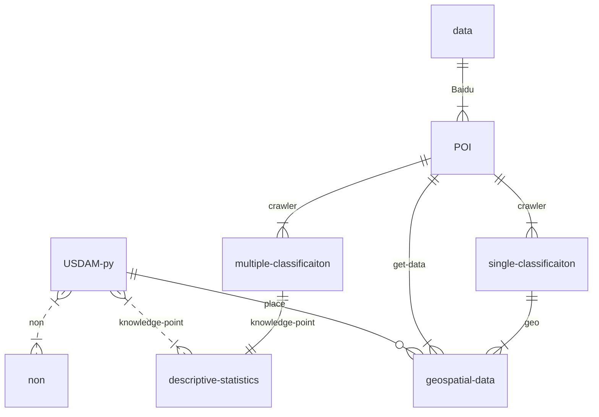

# 章节结构思考————不定性
书的章节结构符合人们的学习习惯会让学习的过程变的顺畅，但是在写作过程中，必然不能一步到位，而是一个不断调整、整合的过程，因此增加了这个部分，来思考这个问题。

### 知识点分布

```mermaid
classDiagram

卷积_SIR传播模型_成本栅格与物种散布_SIR空间传播模型 --|> 数据分析
卷积_SIR传播模型_成本栅格与物种散布_SIR空间传播模型 : 卷积 
卷积_SIR传播模型_成本栅格与物种散布_SIR空间传播模型 : -一维卷积与曲线分割
卷积_SIR传播模型_成本栅格与物种散布_SIR空间传播模型 : -二维卷积与图像特征提取
卷积_SIR传播模型_成本栅格与物种散布_SIR空间传播模型 : SIR传播模型
卷积_SIR传播模型_成本栅格与物种散布_SIR空间传播模型 : 卷积扩散，成本栅格与物种散步_SIR的空间传播模型
卷积_SIR传播模型_成本栅格与物种散布_SIR空间传播模型 --|> 卷积 : 拆分
卷积 --|> 机器学习_深度学习


遥感影像解译_基于NDVI_建立采样工具_GUI_tkinter_混淆矩阵 --|> 数据分析
遥感影像解译_基于NDVI_建立采样工具_GUI_tkinter_混淆矩阵 : 影像数据处理
遥感影像解译_基于NDVI_建立采样工具_GUI_tkinter_混淆矩阵 : 计算NDVI，交互图像与解译
遥感影像解译_基于NDVI_建立采样工具_GUI_tkinter_混淆矩阵 : 采样交互操作平台的建立_tkinter，与精度计算
遥感影像解译_基于NDVI_建立采样工具_GUI_tkinter_混淆矩阵 : 分类精度计算

数据分析 --|> 机器学习_深度学习

点云数据_激光雷达_处理_分类数据_DSM_建筑高度提取_插值 --|> 数据分析
点云数据_激光雷达_处理_分类数据_DSM_建筑高度提取_插值 : 点云数据处理（.las）
点云数据_激光雷达_处理_分类数据_DSM_建筑高度提取_插值 : -查看点云数据信息
点云数据_激光雷达_处理_分类数据_DSM_建筑高度提取_插值 : -建立DSM_分类栅格
点云数据_激光雷达_处理_分类数据_DSM_建筑高度提取_插值 : -批量处理.las点云单元
点云数据_激光雷达_处理_分类数据_DSM_建筑高度提取_插值 : 建筑高度提取
点云数据_激光雷达_处理_分类数据_DSM_建筑高度提取_插值 : -定义获取栅格投影函数，以及栅格重投影函数
点云数据_激光雷达_处理_分类数据_DSM_建筑高度提取_插值 : -按照给定的栅格，获取栅格的范围来裁切.shp格式文件（Polygon）
点云数据_激光雷达_处理_分类数据_DSM_建筑高度提取_插值 : -根据分类栅格数据，从DSM中提取建筑区域的高程数据
点云数据_激光雷达_处理_分类数据_DSM_建筑高度提取_插值 : --区域统计_计算建筑高度

单个分类POI数据爬取与地理空间点地图 --> 数据分析 : 
单个分类POI数据爬取与地理空间点地图 : 单个分类POI爬取
单个分类POI数据爬取与地理空间点地图 : 将csv格式的POI数据转换为pandas的DataFrame
单个分类POI数据爬取与地理空间点地图 : 将数据格式为DataFramed的POI数据转换为GeoPandas地理空间数据GeoDataFrame
单个分类POI数据爬取与地理空间点地图 : 使用plotly库建立地图

多个分类POI数据爬取与描述性统计 --|> 数据分析
多个分类POI数据爬取与描述性统计 --|> 描述性统计 : 拆分
多个分类POI数据爬取与描述性统计 : 多个分类POI爬取
多个分类POI数据爬取与描述性统计 : 批量转换.csv格式数据为GeoDataFrame

描述性统计 --|> 统计学知识点
描述性统计 : 数据种类
描述性统计 : 集中量数与变异量数
描述性统计 : 频数（次数）分布表和直方图
描述性统计 : 中位数
描述性统计 : 算数平均数
描述性统计 : 标准差
描述性统计 : 标准计分

正态分布与概率密度函数_异常值处理 --|> 统计学知识点
正态分布与概率密度函数_异常值处理 : 正态分布
正态分布与概率密度函数_异常值处理 : 概率密度函数
正态分布与概率密度函数_异常值处理 : 累积分布函数
正态分布与概率密度函数_异常值处理 : 偏度与峰度
正态分布与概率密度函数_异常值处理 : 检验数据集是否服从正态分布
正态分布与概率密度函数_异常值处理 : 异常值处理
正态分布与概率密度函数_异常值处理 : 给定特定值计算概率，以及找到给定概率的值

OSM数据处理 --|> 数据分析
OSM数据处理 : OSM原始数据处理
OSM数据处理 : 读取、转换.osm数据

核密度估计与地理空间点密度分布 --|> 数据分析
核密度估计与地理空间点密度分布 --|> 统计学知识点
核密度估计与地理空间点密度分布 : *核密度估计
核密度估计与地理空间点密度分布 : 核密度估计结果转换为地理栅格数据

标准误_中心极限定理_t分布_统计显著性_效应量_置信区间_公共健康数据的地理空间分布与相关性分析 --|> 统计学知识点
标准误_中心极限定理_t分布_统计显著性_效应量_置信区间_公共健康数据的地理空间分布与相关性分析 --|> 公共健康数据的地理空间分布 : 拆分
公共健康数据的地理空间分布 --|> 数据分析
标准误_中心极限定理_t分布_统计显著性_效应量_置信区间_公共健康数据的地理空间分布与相关性分析 :  标准误
标准误_中心极限定理_t分布_统计显著性_效应量_置信区间_公共健康数据的地理空间分布与相关性分析 :  中心极限定理
标准误_中心极限定理_t分布_统计显著性_效应量_置信区间_公共健康数据的地理空间分布与相关性分析 :  t分布
标准误_中心极限定理_t分布_统计显著性_效应量_置信区间_公共健康数据的地理空间分布与相关性分析 :  统计显著性
标准误_中心极限定理_t分布_统计显著性_效应量_置信区间_公共健康数据的地理空间分布与相关性分析 :  效应量
标准误_中心极限定理_t分布_统计显著性_效应量_置信区间_公共健康数据的地理空间分布与相关性分析 :  置信区间
标准误_中心极限定理_t分布_统计显著性_效应量_置信区间_公共健康数据的地理空间分布与相关性分析 :  相关性分析

简单回归_多元回归 --|> 统计学知识点
简单回归_多元回归 : 反函数
简单回归_多元回归 : 指数函数与自然对数函数
简单回归_多元回归 : 微分
简单回归_多元回归 : 矩阵
简单回归_多元回归 : 简单线性回归
简单回归_多元回归 : 多元线性回归

回归公共健康数据与梯度下降法 --|> 统计学知识点
回归公共健康数据与梯度下降法  : 公共健康数据的简单线性回归
回归公共健康数据与梯度下降法  : k-NN（k-近邻模型）
回归公共健康数据与梯度下降法  : MAE平均绝对误差与MSE均方误差
回归公共健康数据与梯度下降法  : 公共健康数据的多元回归
回归公共健康数据与梯度下降法  : 多项式回归
回归公共健康数据与梯度下降法  : 正则化
回归公共健康数据与梯度下降法  : 梯度下降法
回归公共健康数据与梯度下降法 --|> 回归公共健康数据 : 拆分
回归公共健康数据 --|> 数据分析
回归公共健康数据与梯度下降法 --|> 梯度下降法 : 拆分
梯度下降法 --|> 机器学习_深度学习

线性代数基础的代码表述 --|> 线性代数
线性代数基础的代码表述  : 矩阵
线性代数基础的代码表述  : 向量
线性代数基础的代码表述  : 线性无关
线性代数基础的代码表述  : 线性映射
线性代数基础的代码表述  : 秩
线性代数基础的代码表述  : 特征值和特征向量

Landsat遥感影像处理_数字高程_主成成分分析 --|> 数据分析
Landsat遥感影像处理_数字高程_主成成分分析  : Landsat地理信息读取，裁切，融合，打印显示
Landsat遥感影像处理_数字高程_主成成分分析  : 数字高程
Landsat遥感影像处理_数字高程_主成成分分析 --|> 主成分分析 : 拆分
主成分分析 --|> 统计学知识点


```

### 知识关联

```mermaid
erDiagram
    USDAM-py ||--o{ geospatial-data : place 
    USDAM-py }|..|{ non : non
    data ||--|{ POI : Baidu
    POI ||--|{ geospatial-data : get-data
    POI ||--|{ single-classificaiton : crawler
    POI ||--|{ multiple-classificaiton : crawler
    single-classificaiton ||--|{ geospatial-data : geo
    USDAM-py }|..|{ descriptive-statistics : knowledge-point
    multiple-classificaiton ||--|| descriptive-statistics : knowledge-point
```