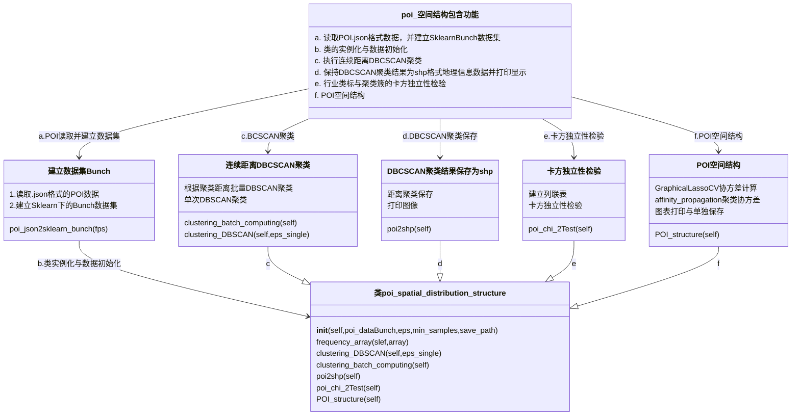

```mermaid
classDiagram

poi_空间结构包含功能 --> 建立数据集Bunch : a.POI读取并建立数据集

poi_空间结构包含功能 : a. 读取POI.json格式数据，并建立SklearnBunch数据集
poi_空间结构包含功能 : b. 类的实例化与数据初始化
poi_空间结构包含功能 : c. 执行连续距离DBCSCAN聚类
poi_空间结构包含功能 : d. 保持DBCSCAN聚类结果为shp格式地理信息数据并打印显示
poi_空间结构包含功能 : e. 行业类标与聚类簇的卡方独立性检验
poi_空间结构包含功能 : f. POI空间结构

建立数据集Bunch : 1.读取.json格式的POI数据
建立数据集Bunch : 2.建立Sklearn下的Bunch数据集
建立数据集Bunch : poi_json2sklearn_bunch(fps)

建立数据集Bunch --> 类 poi_spatial_distribution_structure: b.类实例化与数据初始化
类 poi_spatial_distribution_structure : __init__(self,poi_dataBunch,eps,min_samples,save_path)
类 poi_spatial_distribution_structure : frequency_array(slef,array)
类 poi_spatial_distribution_structure : clustering_DBSCAN(self,eps_single)
类 poi_spatial_distribution_structure : clustering_batch_computing(self)
类 poi_spatial_distribution_structure : poi2shp(self)
类 poi_spatial_distribution_structure : poi_chi_2Test(self)
类 poi_spatial_distribution_structure : POI_structure(self)

poi_空间结构包含功能 --> 连续距离DBCSCAN聚类 : c.BCSCAN聚类
连续距离DBCSCAN聚类 : 根据聚类距离批量DBSCAN聚类
连续距离DBCSCAN聚类 : 单次DBSCAN聚类
连续距离DBCSCAN聚类 : clustering_batch_computing(self)
连续距离DBCSCAN聚类 : clustering_DBSCAN(self,eps_single)
连续距离DBCSCAN聚类 --|> 类 poi_spatial_distribution_structure :c

poi_空间结构包含功能 --> DBCSCAN聚类结果保存为shp : d.DBCSCAN聚类保存
DBCSCAN聚类结果保存为shp : 距离聚类保存
DBCSCAN聚类结果保存为shp : 打印图像
DBCSCAN聚类结果保存为shp : poi2shp(self)
DBCSCAN聚类结果保存为shp --|> 类 poi_spatial_distribution_structure :d

poi_空间结构包含功能 --> 卡方独立性检验 :e.卡方独立性检验
卡方独立性检验 : 建立列联表
卡方独立性检验 : 卡方独立性检验
卡方独立性检验 : poi_chi_2Test(self)
卡方独立性检验  --|> 类 poi_spatial_distribution_structure :e

poi_空间结构包含功能 --> POI空间结构 : f.POI空间结构
POI空间结构 : GraphicalLassoCV协方差计算
POI空间结构 : affinity_propagation聚类协方差
POI空间结构 : 图表打印与单独保存
POI空间结构 : POI_structure(self)
POI空间结构  --|> 类 poi_spatial_distribution_structure :f
```