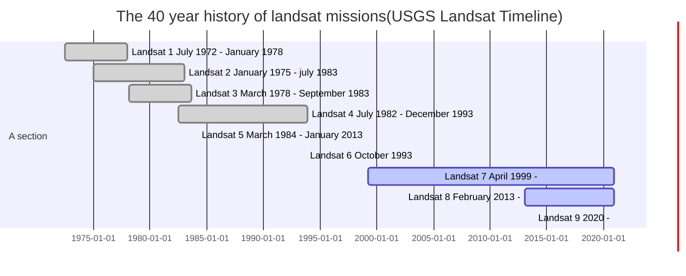

> Created on Tue Nov 26 20/21/48 2019  @author: Richie Bao-caDesign设计(cadesign.cn) __+updated on Fri Jul 31 10/59/55 2020 by Richie Bao

## 1. Landsat遥感影像处理，数字高程，主成成分分析
### 1.1 Landsat地理信息读取，裁切，融合，打印显示
从1970s年代，地球资源卫星（the Landsat series of satellites）几乎不间断的提供全球范围地球表面中分辨率多光谱遥感影像数据。不间断的数据记录，增强了应用数据分析的潜力，可以帮助各领域的研究者在人口不断增长，城市不断发展下，关注粮食、水、森林等自然资源，应用其无以伦比的影像质量、覆盖率、细节价值分析城市的发展与自然平衡的问题(美国地质调查局[USGS-earthexplorer,United States Geological Survey](https://earthexplorer.usgs.gov/))。

> 注，下述mermaid图表代码，在JupyterLab下无法显示，但是在通常的markdown下显示。


Landsat陆地资源卫星的数据为多光谱，通过安装在环绕地球轨道的太空卫星上的平台收集。各个卫星传感器所获遥感影像数据的波段情况有所差异，下述为Landsat 8各波段的情况：

| 波段(band)  | 波长（wavelength range）/nanometers  | 空间分辨率（spatial resolution）/m  |光谱宽度（spetral width）/nm   |用途   |
|---|---|---|---|---|
| Band 1- Coastal aerosol | 430 - 450  | 30  |20   |  沿海和气溶胶研究 |
| Band 2- Blue 蓝色波段 | 450 - 510  |  30 |  60 |  水深绘图，从植被中区分土壤，针叶林植被中区分落叶 |
| Band 3- Green  绿色波段| 530 - 590  |  30 |  60 | 强度植被生长高峰，用于评估植被活力  |
| Band 4- Red  红色波段| 640 - 670  |  30 |  30 | 处于叶绿素吸收区，用于观测道路，裸露土壤，植被种类等  |
| Band 5- Near Infrared(NIR) 近红外波段 | 850 - 880  | 30  | 30  | 强调生物量和海岸线  |
| Band 6- Shortwave Infrared 1(SWIR1) 短波红外波段1 |1570 - 1650   | 30  | 80  | 区分土壤和植被含水量，并能穿透薄云  |
| Band 7- Shortwave Infrared 2(SWIR2)  短波红外波段2| 2110 - 2290  |  30 |  180 |  增加的区分土壤和植被含水量，并能穿透薄云 |
| Band 8- Panchromatic  全色波段|500 - 680   | 15  | 180  | 15米分辨率，更清晰的图像清晰度  |
| Band 9- Cirrus clouds  卷云波段| 1360 - 1380  | 30  | 20  | 改进了对卷云污染的检测  |
| Band 10- Thermal Infrared 1(TIRS_1)  热红外波段1| 10600 - 11190  | 100  | 590  | 100米分辨率，热红外图，可估计的土壤湿度 |
| Band 11- Thermal Infrared 2(TIRS_2)  热红外波段2| 11500 - 12510  | 100  | 1010 | 100米分辨率，增加的热红外图，可估计的土壤湿度  |

Landsat系列遥感影像在城市的研究中作用举足轻重，在不同的研究领域中均需要使用该数据分析，例如从上个世纪70年代至今城市及自然环境的演化，用地类型的变化，反演地表温度研究城市热环境，绿地变化与生态影响，水资源情况等等不计其数。除了Landsate中分辨率卫星，还有高空分辨率低于1m的高分辨率遥感影像，探究城市的细微变化，尤其包含有近红外波段的高分辨率影像，可以在微尺度上深入植被研究，以及拓展相关研究。

* Landsat文件名所包含的信息

例如：LC08_L1TP_023031_20180310_20180320_01_T1

L=Landsat。 案例为L

X=传感器，“C”代表OLI/TIRS组合，“O”代表OLI，“T”代表TIRS，“E”代表ETM+，“T”代表TM，“M”代表MSS。案例为C，即OLI/TIRS组合传感器

S=卫星。案例为08

[LLLL](https://www.usgs.gov/land-resources/nli/landsat/landsat-levels-processing)=处理矫正水平（Processing correction level），由地面控制点、数字高程和传感器收集的数据确定。“L1TP”（Precision Terrain）为1级精度地形矫正产品，如果参考数据不充足，则处理为系统的、地形矫正的L1GT(Systematic Terrain)和L1GS(Systematic)产品。案例为L1TP

PPP=WRS path  世界参考系统（the Worldwide Reference）,是Landsat卫星数据的全球定位系统。可以指定path，row查询世界上任何部分的卫星图像。案例为023

RRR=WRS row。 案例为031

YYYYMMDD=获取年份。案例为20180310

yyyymmdd=处理年份。案例为20180320

CC=采集编号（01，02）。案例为01

[TX](https://www.usgs.gov/land-resources/nli/landsat/landsat-collection-1?qt-science_support_page_related_con=1#qt-science_support_page_related_con)=采集类别（"RT"为实时，"T1"为层1（Tier1）包含最高数据质量；"T2"为层2，因为缺失数据精度较T1低）。案例为T1

对于遥感影像的处理，即为对raser栅格数据的处理，可以使用rasterio，earthpy，GDAL等库读写，定义或重定义投影坐标系统，裁切与融合，数据处理及可视化等。

> 该部分参考文献
> 1. Cavin Hackeling. Mastering Machine Learning with scikit-learn[M].Packt Publishing Ltd.July 2017.Second published. 中文版为：Cavin Hackeling.张浩然译.scikit-learning 机器学习[M].人民邮电出版社.2019.2
2. [日]高桥 信著作,Inoue Iroha,株式会社 TREND-PRO漫画制作,腾永红译.漫画线性代数[M].科学出版社.北京.2009.08；


```python
import earthpy.spatial as es
import earthpy.plot as ep
import earthpy.mask as em
import matplotlib.pyplot as plt

from glob import glob
import os,re
plt.rcParams.update({'font.size': 20})

workspace=r"F:\data_02_Chicago\9_landsat\data_processing"
Landsat_fp={
        "w_180310":r"F:\data_02_Chicago\9_landsat\LC08_L1TP_023031_20180310_20180320_01_T1", #冬季
        "s_190820":r"F:\data_02_Chicago\9_landsat\LC08_L1TP_023031_20190804_20190820_01_T1", #夏季
        "a_191018":r"F:\data_02_Chicago\9_landsat\LC08_L1TP_023031_20191007_20191018_01_T1" #秋季   
        }
w_landsat=glob(os.path.join(Landsat_fp["w_180310"],"*_B[0-9]*.tif"))

band_name={'B1':'coastal_aerosol','B2':'blue','B3':'green','B4':'red','B5':'near_infrared','B6':'SWIR_1','B7':'SWIR_2','B8':'panchromatic','B9':'cirrus','B10':'TIRS_1','B11':'TIRS_2'}

def fp_sort(fp_list,str_pattern,prefix=""):
    '''
    function - 按照文件名中的数字排序文件列表
    
    Paras:
    fp_list - 文件列表
    str_pattern - 字符串匹配模式，用于提取文件名中的数字
    prefix - 字典数据格式的键名前缀
    
    return:
    fn_sort - 返回排序后的列表
    fn_dict - 返回字典
    '''
    fn_num_extraction=[(int(re.findall(str_pattern, fn)[0]),fn) for fn in fp_list]
    fn_sort=sorted(fn_num_extraction)
    fn_dict=dict([("%s"%prefix+str(i[0]),i[1]) for i in fn_sort])
    return fn_sort,fn_dict
    
str_pattern=re.compile(r'B(.*?)[.]', re.S)  
fn_sort,fn_dict=fp_sort(w_landsat,str_pattern,prefix="B")    

#打印遥感影像波段
array_stack, meta_data=es.stack([fn[1] for fn in fn_sort][:7], nodata=-9999)
ep.plot_bands(array_stack, title=list(band_name.values())[:7],cols=7,cbar=True,figsize=(10*7,10))
plt.show()
```


<a href=""></a>


上述通过给定Landsat文件夹，用glob库获取指定字符串匹配模式的所有文件路径，即landsat各个波段的路径名，然后使用earthpy库.stack叠合层为一个变量，注意只有空间分辨率相同的层可以叠合，因此叠合了前7个波段，并使用该库打印显示。下述代码则定义了`LandsatMTL_info(fp)`函数，给定landsat所在根目录，读取元文件，即_MTL.txt文件，通过读取元文件获取相关影像信息，并获取各个波段的路径。


```python
def LandsatMTL_info(fp):
    '''
    function - 读取landsat *_MTL.txt文件，提取需要的信息
    
    Paras:
    fp - Landsat 文件根目录
    
    return:
    band_fp_dic - 返回各个波段的路径字典
    Landsat_para - 返回Landsat 参数 
    '''
    fps=[os.path.join(root,file) for root, dirs, files in os.walk(fp) for file in files] #提取文件夹下所有文件的路径
    MTLPattern=re.compile(r'_MTL.txt',re.S) #匹配对象模式，提取_MTL.txt遥感影像的元数据文件
    MTLFn=[fn for fn in fps if re.findall(MTLPattern,fn)][0]
    with open(MTLFn,'r') as f: #读取所有元数据文件信息
        MTLText=f.read()
    bandFn_Pattern=re.compile(r'FILE_NAME_BAND_[0-9]\d* = "(.*?)"\n',re.S)  #Landsat 波段文件
    band_fn=re.findall(bandFn_Pattern,MTLText)
    band_fp=[[(re.findall(r'B[0-9]\d*',fn)[0], re.findall(r'.*?%s$'%fn,f)[0]) for f in fps if re.findall(r'.*?%s$'%fn,f)] for fn in band_fn] #(文件名，文件路径)
    band_fp_dic={i[0][0]:i[0][1] for i in band_fp}
    #需要数据的提取标签/根据需要读取元数据信息
    values_fields=["RADIANCE_ADD_BAND_10",
                   "RADIANCE_ADD_BAND_11",
                   "RADIANCE_MULT_BAND_10",
                   "RADIANCE_MULT_BAND_11",
                   "K1_CONSTANT_BAND_10",
                   "K2_CONSTANT_BAND_10",
                   "K1_CONSTANT_BAND_11",
                   "K2_CONSTANT_BAND_11",
                   "DATE_ACQUIRED",
                   "SCENE_CENTER_TIME",
                   "MAP_PROJECTION",
                   "DATUM",
                   "UTM_ZONE"]

    Landsat_para={field:re.findall(re.compile(r'%s = "*(.*?)"*\n'%field),MTLText)[0] for field in values_fields} #（参数名，参数值）
    return  band_fp_dic,Landsat_para #返回所有波段路径和需要的参数值

band_fp_dic,Landsat_para=LandsatMTL_info(Landsat_fp["w_180310"])
print(band_fp_dic)
print(Landsat_para)
```

    {'B1': 'F:\\data_02_Chicago\\9_landsat\\LC08_L1TP_023031_20180310_20180320_01_T1\\LC08_L1TP_023031_20180310_20180320_01_T1_B1.TIF', 'B2': 'F:\\data_02_Chicago\\9_landsat\\LC08_L1TP_023031_20180310_20180320_01_T1\\LC08_L1TP_023031_20180310_20180320_01_T1_B2.TIF', 'B3': 'F:\\data_02_Chicago\\9_landsat\\LC08_L1TP_023031_20180310_20180320_01_T1\\LC08_L1TP_023031_20180310_20180320_01_T1_B3.TIF', 'B4': 'F:\\data_02_Chicago\\9_landsat\\LC08_L1TP_023031_20180310_20180320_01_T1\\LC08_L1TP_023031_20180310_20180320_01_T1_B4.TIF', 'B5': 'F:\\data_02_Chicago\\9_landsat\\LC08_L1TP_023031_20180310_20180320_01_T1\\LC08_L1TP_023031_20180310_20180320_01_T1_B5.TIF', 'B6': 'F:\\data_02_Chicago\\9_landsat\\LC08_L1TP_023031_20180310_20180320_01_T1\\LC08_L1TP_023031_20180310_20180320_01_T1_B6.TIF', 'B7': 'F:\\data_02_Chicago\\9_landsat\\LC08_L1TP_023031_20180310_20180320_01_T1\\LC08_L1TP_023031_20180310_20180320_01_T1_B7.TIF', 'B8': 'F:\\data_02_Chicago\\9_landsat\\LC08_L1TP_023031_20180310_20180320_01_T1\\LC08_L1TP_023031_20180310_20180320_01_T1_B8.TIF', 'B9': 'F:\\data_02_Chicago\\9_landsat\\LC08_L1TP_023031_20180310_20180320_01_T1\\LC08_L1TP_023031_20180310_20180320_01_T1_B9.TIF', 'B10': 'F:\\data_02_Chicago\\9_landsat\\LC08_L1TP_023031_20180310_20180320_01_T1\\LC08_L1TP_023031_20180310_20180320_01_T1_B10.TIF', 'B11': 'F:\\data_02_Chicago\\9_landsat\\LC08_L1TP_023031_20180310_20180320_01_T1\\LC08_L1TP_023031_20180310_20180320_01_T1_B11.TIF'}
    {'RADIANCE_ADD_BAND_10': '0.10000', 'RADIANCE_ADD_BAND_11': '0.10000', 'RADIANCE_MULT_BAND_10': '3.3420E-04', 'RADIANCE_MULT_BAND_11': '3.3420E-04', 'K1_CONSTANT_BAND_10': '774.8853', 'K2_CONSTANT_BAND_10': '1321.0789', 'K1_CONSTANT_BAND_11': '480.8883', 'K2_CONSTANT_BAND_11': '1201.1442', 'DATE_ACQUIRED': '2018-03-10', 'SCENE_CENTER_TIME': '16:34:42.6511940Z', 'MAP_PROJECTION': 'UTM', 'DATUM': 'WGS84', 'UTM_ZONE': '16'}
    

从元文件获取的信息中，能够得知最基本的信息，包括投影坐标系统，为WGS84，UTM_ZONE 16。如果要对影像裁切，需要保持用于裁切的边界.shp文件与其保持相同的投影。可以用rasterio库读取一个landsat波段，直接获取该波段的crs格式的投影坐标系统来转化.shp边界的坐标系统。earthpy库提供的裁切工具.crop_all可以一次性裁切多个波段，即栅格文件。


```python
import geopandas as gpd
from pyproj import CRS
import rasterio as rio

shape_polygon_fp=r'.\data\geoData\LandsatChicago_boundary.shp'
crop_bound=gpd.read_file(shape_polygon_fp)

#获取Landsat遥感影像的投影坐标系统，用于.shp格式的裁切边界，保持投影一致，裁切正确
with rio.open(band_fp_dic['B1']) as raster_crs:
    crop_raster_profile=raster_crs.profile
    crop_bound_utm16N=crop_bound.to_crs(crop_raster_profile["crs"])
print(crop_bound_utm16N.crs)

output_dir=os.path.join(workspace,r"w_180310")
w_180310_band_paths_list=es.crop_all(band_fp_dic.values(), output_dir, crop_bound_utm16N, overwrite=True) #对所有波段band执行裁切
print("finished cropping...")
```

    PROJCS["WGS 84 / UTM zone 16N",GEOGCS["WGS 84",DATUM["WGS_1984",SPHEROID["WGS 84",6378137,298.257223563,AUTHORITY["EPSG","7030"]],AUTHORITY["EPSG","6326"]],PRIMEM["Greenwich",0,AUTHORITY["EPSG","8901"]],UNIT["degree",0.0174532925199433,AUTHORITY["EPSG","9122"]],AUTHORITY["EPSG","4326"]],PROJECTION["Transverse_Mercator"],PARAMETER["latitude_of_origin",0],PARAMETER["central_meridian",-87],PARAMETER["scale_factor",0.9996],PARAMETER["false_easting",500000],PARAMETER["false_northing",0],UNIT["metre",1,AUTHORITY["EPSG","9001"]],AXIS["Easting",EAST],AXIS["Northing",NORTH],AUTHORITY["EPSG","32616"]]
    finished cropping...
    

将裁切后的文件堆叠在一个变量下，可以直接使用索引的方式读取任何一层，方便对多光谱遥感影像管理。


```python
w_180310_stack_fp=os.path.join(workspace,r"w_180310_stack.tif")
w_180310_array, w_180310_raster_prof=es.stack(w_180310_band_paths_list[:7], out_path=w_180310_stack_fp)
print("finished stacking...")
```

    finished stacking...
    

将不同的波段合成显示，可以有不同的显示结果，方便不同目的性的观察，通常如下：

| R、G、B  | 主要用途  |
|---|---|
|  4、 3 、 2 Red、 Green 、 Blue | 自然真彩色  | 
| 7、 6 、 4  SWIR2、 SWIR1 、 Red|  城市 |
| 5、4、3  NIR、 Red 、 Green | 标准假彩色图像，植被  |
| 6、5、2  SWIR1、 NIR 、 Blue|农业   |
| 7、 6 、 5  SWIR2、 SWIR1 、 NIR|  穿透大气层 |
| 5、 6 、 2  NIR、 SWIR1 、 Blue|  健康植被 |
|5、 6 、 4   NIR、 SWIR1 、 Red|  陆地/水 |
| 7、 5 、 3  SWIR2、 NIR 、 Green|  移除大气影响的自然表面 |
|7、 5 、 4  SWIR2、 NIR 、 Red | 短波红外  |
| 6、 5 、 4  SWIR1、 NIR 、 Red| 植被分析  |


```python
from rasterio.plot import plotting_extent
extent=plotting_extent(w_180310_array[0],  w_180310_raster_prof["transform"])

plt.rcParams.update({'font.size': 12})
fig, axs = plt.subplots(1,2,figsize=(25, 12))
ep.plot_rgb(
    w_180310_array,
    rgb=[3,2,1],
    stretch=True,
    extent=extent,
    str_clip=0.5,
    title="w_180310_B4,B3,B2",
    ax=axs[0]
)

ep.plot_rgb(
    w_180310_array,
    rgb=[5,4,1], #4/3/2  5/4/1 波段对应文件，为波段号减1
    stretch=True,
    extent=extent,
    str_clip=0.5,
    title="w_180310_B6,B5,B2",
    ax=axs[1]
)

plt.show()
```


<a href=""></a>


### 1.2 主成分分析（Principal components，PCA）
#### 1.2.1 解析主成分分析
对于除了全色之外的所有波段，是否有一种方式可以将10个波段的信息降维为1个，并保留最大的信息量，然后再结合相关波段共同打印RGB图像？在机器学习领域经常会遇到成百上千，甚至更多的特征向量作为解释变量的输入训练模型，主成分分析（principal component analysis ，PCA）即为其中一种降低数据维度的技术，可以用于压缩数据，减少内存使用和减负CPU/GPU的处理能力，探索数据集并将高维数据在二三维度上显示观察。

> 理解该部分的知识，需要先理解‘线性代数基础的代码表述’部分内容，才能更好的阅读该部分。

主成分分析是一种统计分析，简化数据集的方法。利用**正交变换**来对一系列可能相关的变量的观测值进行线性变换，从而投影为一系列**线性无关**变量的值，这些不相关变量称为主成分（Principal Componnets）。主成分分析经常用于减少数据集的维数，并保留数据集中对方差贡献最大的特征。主成分分析依赖所给数据，数据的准确性对分析结果影响很大。对于主成分分析的解读包括专著教材、网络，有非常多的版本，而其中[amoeba](https://stats.stackexchange.com/users/28666/amoeba)给出的[PCA解读](https://stats.stackexchange.com/questions/2691/making-sense-of-principal-component-analysis-eigenvectors-eigenvalues/140579#140579)配合GIF动画是最容易让人理解的一种解读，因此以该解读为主要结构，使用python实现。这里为了方便阐述PCA，自行生成了一个随机数据集X，包含两个特征，即两组解释变量，为了使得数据两个特征具有一定的线性关系，对该数据集乘以一个变换矩阵`transformation= [[-0.6, -0.6], [-0.3, -0.9]]`，线性变换数据的分布（参看线性映射部分）。

这些特征点的分布（分别由一个特征作为x坐标，另一个作为y坐标），将其绘制于我们熟悉的二维的笛卡尔坐标系（Cartesian coordinate system，也称直角坐标系），目的是试图找到一条直线（新的坐标轴），再将所有点投影到该直线上，从而构建一个新属性，这个属性将由$w_{1} x+w_{2} y$线性组合定义，每条线对应$w_{1} $和$w_{2} $的特定值。那么在下述旋转的直线中，哪条直线的投影点能够保留原特征数据集的最大信息量，首先这条线上投影点的差异应该最大化，即反应分布的方差最大，从下图的变化中，可以观察到新特征即红色投影点（重建于原本的两个特征）方差的变化，当直线旋转到蓝色轴v_n_j时，方差达到最大，从特征点的分布上也能够容易观察到这个变化趋势。这个投影点当其方差大于到第2个轴的投影时为第1主成分，否则为第2主成分。整体的重建误差通过特征点到相应投影点的距离均方根来衡量，而两个旋转的轴永远是垂直的，投影点到特征点的距离与投影点到原点的距离正好与特征点到原点的距离构成直角三角形，因此对于重建误差的测量可以转换为投影点方差的测量，即投影点方差越高，误差越低。

使得投影点方差为最大的新坐标轴是由特征点的协方差求得，$\begin{bmatrix}0.36372533(x(i)|x(i)) & 0.55326727 (y(j)|x(i))\\0.55326727(x(i)|y(j)) & 1.10198785(y(j)|y(j)) \end{bmatrix} $,其中$x(i)|x(i)$及$y(j)|y(j)$是各个特征自身的方差；而$y(j)|x(i)$和$x(i)|y(j)$则是特征之间的协方差，其值相同。所要寻找的新的坐标系是使得特征点到新坐标系其中一个轴的投影的方差为最大，相对到其它轴投影方差则次第减小，则说明轴之间的方差即$y(j)|x(i)$和$x(i)|y(j)$趋近于0，其它轴的投影点方差也相对较小。$\begin{bmatrix}3.11020298e-04(x(i)|x(i)) & -4.96686164e-18 (y(j)|x(i))\\-4.96686164e-18(x(i)|y(j)) & 2.73202237e+00(y(j)|y(j)) \end{bmatrix} $，从计算的结果也能观察到这一特点，其中只有$y(j)|y(j)$的方差最大，其它的均趋于0。轴之间的协方差基本为0，即基本不存在相关性，即当协方差为0时，表示两个特征基本完全独立，而为了让协方差为0，在确定第2个轴（基）时只能在与第一个轴（基）正交方向上选择，因此新坐标系的两个轴是正交垂直的。

由上述表述可以进一步推广到一般维度上的降维问题，将一组N维特征向量降到K维，其中$0<K<N$，选择K个单位（模为1）的正交基（新的坐标系或向量空间），使得原始数据变换到这组基上后，各个特征间协方差为0，而特征的方差则尽可能大，在正交的约束下取最大的K各方差对应的基（轴）。

由原始特征值的协方差方阵计算特征向量和特征值，所计算的单位特征向量就是新坐标轴的方向，而特征值是坐标轴的长度（相对于原始对应坐标轴单位的倍数）。对于为什么协方差矩阵的特征向量和特征值的求得就为新的坐标系，可以理解为，假设原始特征的坐标系的轴表示为：$\vec i(x),\vec j(y)$，单位长度为1，所有特征向量可以表示为$\begin{cases}c_{11} i+ c_{12}j \\c_{21} i+ c_{22}j \\ \ldots \\ c_{n1} i+ c_{n2}j\end{cases}$，如果将方差的值认为是能反映该类特征分布的一个代表，则所有的特征向量可以简化表示为$s_{1}i+ s_{2}  j$，那么协方差矩阵可以表示为：$\begin{bmatrix} s_{1}i & s_{-}  j i \\ s_{-}i j & s_{2}  j \end{bmatrix}  $。原坐标系（向量空间）可以通过单位向量矩阵表示为：$\begin{bmatrix}1*i & 0*j\\0*i& 1*j \end{bmatrix} = \begin{bmatrix}i & 0 \\0& j\end{bmatrix} $，新的坐标系可以表示为：$\begin{bmatrix} w_{1}i  & 0 \\0 &  w_{2} j \end{bmatrix} $。可以观察到协方差矩阵与新坐标系形式相似，对协方差矩阵对角化（即除了对角线外的其它元素化为0）后，就可以获得新坐标系的轴（基），对角化就是求特征向量和特征值。**（对于为什么由协方差矩阵计算特征向量和特征值即可获得可由方差大小排序的新坐标系的阐述一般，如果不理解可以掠过该段）**。

* 方差和协方差

在方差和协方差部分已经给出了方差和协方差的解释，方差（Variance）用于衡量一组值的分布，是每个值和均值平方差的平均，公式为：$s^{2} = \frac{ \sum_{i=1}^n  ( X_{i}- \overline{X}  )^{2}  }{n-1} $；协方差（Covariance）用于行列两个变量之间分布相关性程度的方法，其公式为：$cov(X,Y)= \frac{ \sum_{i=1}^n ( X_{i}-  \overline{x}  )( Y_{i} - \overline{y} ) }{n-1} $。

如果协方差为0，则变量不相关；如果非0，正负号表示正负相关，正相关时，一个变量随另一个变量的增加而增加；为负相关时，一个变量随其均值增加时，另一个变量相对于其均值减小。协方差矩阵（离差矩阵，或方差-协方差矩阵）描述了一个数据集中每一对维度数变量的协方差。如果元素$(i,j)$表示数据$i^{th} $维和$j^{th} $维的协方差，则一个三维协方差矩阵公式如下：$C= \begin{bmatrix}cov( x_{1},x_{1} ) & cov( x_{1},x_{2} ) &cov( x_{1},x_{3} )\\cov( x_{2},x_{1} ) & cov( x_{2},x_{2} )&cov( x_{2},x_{3} ) \\  cov( x_{3},x_{1} ) & cov( x_{3},x_{2} )&cov( x_{3},x_{3} ) \end{bmatrix} $。使用经典的iris数据集，拓展协方差二维到4维数据，每一维度为一个特征。协方差的计算直接使用numpy、pandas等库。

* 再议特征值和特征向量

对于公式$A \xi = \lambda  \xi $，或表述为$A \vec v = \lambda  \vec v$,其中在$A$变换矩阵的作用下，向量$ \xi $或 $\vec v$仅仅在尺度上变为原来的$\lambda$倍。称向量$ \xi $或 $\vec v$是$A$的一个特征向量，$\lambda$是对应的特征值，即一个矩阵乘以它的特征向量，等于对这个特征向量作缩放。特征向量和特征值只能由方阵衍生，同时并非所有的方阵都有特征向量和特征值。如果一个矩阵有特征向量和特征值，它的每一个维度上都有一个特征向量和特征值。一个矩阵的主成分是它的协方差矩阵的特征向量，对应最大特征值的特征向量是第1个主成分，对应第2大特征值的特征向量是第2个主成分，以此类推。


```python
%matplotlib inline
import numpy as np
from numpy import linalg as LA
import util
from sympy.vector.coordsysrect import CoordSys3D
from sympy.vector.vector import Vector, BaseVector
from sympy import pprint
import matplotlib.pyplot as plt
from IPython.display import HTML

fig, axs=plt.subplots(1,2,figsize=(25,12))
np.random.seed(42)

#定义向量空间 C
C=CoordSys3D('C')
i, j, k = C.base_vectors()
v1_origin=Vector.zero

#建立随机数据集
n_samples=100
X=np.random.randn(100,2)
transformation= [[-0.6, -0.6], [-0.3, -0.9]]
X=np.dot(X, transformation)
axs[0].scatter(X[:,0],X[:,1],label='X')
axs[1].scatter(X[:,0],X[:,1],label='X')

#计算特征值和特征向量
w,v=LA.eig(np.cov(X.T))
print("covariance:\n",np.cov(X.T))
print("eigenvalues:\n",w)
print("eigenvectors:\n",v)

#特征值乘以特征向量和特征值，获得样本新的特征
new_X=np.matmul(X,w*v)
print("new build fearure covariance:\n",np.cov(new_X.T))

#根据特征向量建立新坐标轴
v_n_i=v[0][0]*i+v[1][0]*j
v_n_j=v[0][1]*i+v[1][1]*j

def vector_plot_2d(ax_2d,C,origin_vector,vector,color='r',label='vector',width=0.022):
    '''
    funciton - 转换SymPy的vector及Matrix数据格式为matplotlib可以打印的数据格式

    Paras:
    ax_2d - matplotlib的2d格式子图
    C - /coordinate_system - SymPy下定义的坐标系
    origin_vector - 如果是固定向量，给定向量的起点（使用向量，即表示从坐标原点所指向的位置），如果是自由向量，起点设置为坐标原点
    vector - 所要打印的向量
    color - 向量色彩
    label - 向量标签
    arrow_length_ratio - 向量箭头大小     
    '''
    origin_vector_matrix=origin_vector.to_matrix(C)
    x=origin_vector_matrix.row(0)[0]
    y=origin_vector_matrix.row(1)[0]

    vector_matrix=vector.to_matrix(C)
    u=vector_matrix.row(0)[0]
    v=vector_matrix.row(1)[0]

    ax_2d.quiver(float(x),float(y),float(u),float(v),color=color,label=label,width=width)

vector_plot_2d(axs[0],C,v1_origin,v_n_i,color='r',label='v_n_i',width=0.005)
vector_plot_2d(axs[0],C,v1_origin,v_n_j,color='b',label='v_n_j',width=0.005)

vector_plot_2d(axs[1],C,v1_origin,v_n_i,color='r',label='v_n_i',width=0.005)
vector_plot_2d(axs[1],C,v1_origin,v_n_j,color='b',label='v_n_j',width=0.005)

import matplotlib.animation
#绘制旋转的坐标轴，观察
def circle_lines(center,radius,division):    
    import math
    import numpy as np
    '''
    function - 给定圆心，半径，划分份数，计算所有直径的首尾坐标

    Para:
    center - 圆心
    radius - 半径
    division - 划分份数

    return：

    '''    
    angles=np.linspace(0,2*np.pi,division)
    x=np.cos(angles)*radius
    y=np.sin(angles)*radius
    xy=np.array(list(zip(x,y)))    
    xy=xy+center
    
    #x_=np.cos(np.pi-angles)*radius
    #y_=np.sin(np.pi-angles)*radius
    x_=-x
    y_=-y
    xy_=np.array(list(zip(x_,y_)))
    xy_=xy_+center
    
    xy_head_tail=np.concatenate((xy,xy_),axis=1)
    return xy,xy_,xy_head_tail

center=(0,0)
radius=5
division=360
_,_,xy_head_tail=circle_lines(center,radius,division)

#点到直线的投影
def point_Proj2Line(line_endpts,point):
    import numpy as np
    '''
    function - 计算二维点到直线上的投影
    
    Paras:
    line_endpts - 直线首尾点坐标
    point - 待要投影的点
    
    return:
    P - 投影点
    '''
    pts=np.array(point)
    Line_s=np.array(line_endpts[0])
    Line_e=np.array(line_endpts[1])
    
    n=Line_s - Line_e
    #n/=np.linalg.norm(n, 2)
    n_=n/np.linalg.norm(n, 2)
    
    P=Line_e + n_*np.dot(pts - Line_e, n_)
    #print("投影点坐标",P)    
    
    return P

line,=axs[0].plot([2, -2],[0,0], color = 'gray', linewidth = 1) #旋转的轴1初始化
line_v,=axs[0].plot([0, 0],[2,-2], color = 'silver', linewidth = 1)#旋转的轴2（垂直轴1）初始化

pts_proj_initial=np.array([point_Proj2Line(((2,0),(-2,0)),p) for p in X ]) #计算投影点
pts_proj=axs[0].scatter(pts_proj_initial[:,0],pts_proj_initial[:,1],c='r',label='project points') #投影点初始化

var_text=axs[0].text(0.05, 0.8, '', transform=axs[0].transAxes) #打印文字初始化
var_template='the variance of the projected feature  = %.3f'

v_lines=axs[0].plot([pts_proj_initial[:,0],X[:,0]],[pts_proj_initial[:,1],X[:,1]], color = 'palegoldenrod',linewidth = 1) #特征点和投影点垂直线初始化

#子图更新
def update(xy_head_tail):
    '''
    function - matplolib animation update method
    '''
    x,y,x_,y_=xy_head_tail[0], xy_head_tail[1],xy_head_tail[2],xy_head_tail[3]
    pts_p=np.array([point_Proj2Line(((x,y),(x_,y_)),p) for p in X ])
    
    line.set_data([x,x_],[y,y_])  
    line_v.set_data([-y/4,-y_/4],[x/4,x_/4])
    
    #if x*y<0:
        #line_v.set_data([-y/2,-y_/2],[x/2,x_/2])
    #else:
        #line_v.set_data([y/2,y_/2],[-x/2,-x_/2])
    
    pts_proj.set_offsets(pts_p)
    pts_proj_var=np.var(pts_p)
    
    var_text.set_text(var_template % (pts_proj_var))
    
    for i in range(pts_p.shape[0]):
        v_lines[i].set_data([pts_p[i][0],X[i][0]],[pts_p[i][1],X[i][1]])
        
    return line,

axs[0].legend()
axs[1].legend()
anima=matplotlib.animation.FuncAnimation(fig, update, frames=xy_head_tail, blit=True, interval=100)
HTML(anima.to_html5_video())
```

    covariance:
     [[0.36372533 0.55326727]
     [0.55326727 1.10198785]]
    eigenvalues:
     [0.06775316 1.39796002]
    eigenvectors:
     [[-0.88175912 -0.47169996]
     [ 0.47169996 -0.88175912]]
    new build fearure covariance:
     [[ 3.11020298e-04 -4.96686164e-18]
     [-4.96686164e-18  2.73202237e+00]]
    


<a href=""></a>


```python
#保存动画为.gif文件
from matplotlib.animation import FuncAnimation, PillowWriter 
writer = PillowWriter(fps=25) 
anima.save(r"./imgs/pca.gif", writer=writer)
```

#### 1.2.2 三维度PCA
上述阐述PCA时，从二维度入手，这样比较方便观察，下述则以机器学习经典鸢尾花（iris）数据集为例，提取其中的三个特征用于说明三个维度下特征值的PCA降维。其基本过程同两个维度，只是在图表分析上结合使用三维图形，更好的观察，而对于更高的维度，则可以借助对2，3维的理解，可以自行想象构建方便理解的高纬度空间。目前对于高纬度空间的图表研究也有很多研究成果，可以尝试借助其中的方法来可视化高维空间。


```python
import numpy as np
import pandas as pd
import plotly.express as px
import matplotlib.pyplot as plt
import seaborn as sns
sns.set()

iris_df=px.data.iris()
feature_selection=["sepal_length","sepal_width","petal_width","species"]
COV_iris=iris_df[feature_selection].cov() #先从3维度讲起，方便打印观察，["sepal_length","sepal_width","petal_length","petal_width"]
print("iris covariance",COV_iris)
f, ax = plt.subplots(figsize=(9,8))
sns.heatmap(COV_iris, annot=True, linewidths=.5, ax=ax)

fig=px.scatter_3d(iris_df, x='sepal_length', y='sepal_width', z='petal_width',color='species',width=1200, height=800) #symbol='species'
fig.show()
```

    iris covariance               sepal_length  sepal_width  petal_width
    sepal_length      0.685694    -0.039268     0.516904
    sepal_width      -0.039268     0.188004    -0.117981
    petal_width       0.516904    -0.117981     0.582414
    


    <matplotlib.axes._subplots.AxesSubplot at 0x14138167d08>


<a href=""></a>

<a href=""></a>


在三维空间打印特征点，和对应的投影点，以及各自的坐标系。第1主成分延着N_i轴分布，具有较大的方差，而另外两个轴的特征值相对第一个轴值很小，即在2，3轴的特征点对应的投影点的方差很小。因此第一主成分很好的保留了iris特征值的属性，达到了降维的目的。


```python
from numpy import linalg as LA
import util
from sympy.vector.coordsysrect import CoordSys3D
from sympy.vector.vector import Vector, BaseVector
from sympy import pprint

COV_iris_array=COV_iris.to_numpy()
w,v=LA.eig(COV_iris_array)
print("eigenvalues:\n",w)
print("eigenvectors_normalized:\n",v)

iris_3Features=iris_df[feature_selection]
import pandas as pd
pd.options.mode.chained_assignment = None
species_colors={'setosa':'red', 'versicolor':'blue', 'virginica':'yellow'}
iris_3Features['color']=iris_3Features.species.apply(lambda row:species_colors[row])

fig, axs=plt.subplots(1,2,figsize=(25,12))
axs[0]=fig.add_subplot(1,2,1, projection='3d')
axs[1]=fig.add_subplot(1,2,2,projection='3d')
axs[0].scatter(iris_3Features.sepal_length,iris_3Features.sepal_width,iris_3Features.petal_width,c=iris_3Features.color,)

C=CoordSys3D('C')
i, j, k = C.base_vectors()
v1_origin=Vector.zero
util.vector_plot_3d(axs[0],C,v1_origin,2*i,color='salmon',label='C_i',arrow_length_ratio=0.1)
util.vector_plot_3d(axs[0],C,v1_origin,2*j,color='maroon',label='C_j',arrow_length_ratio=0.1)
util.vector_plot_3d(axs[0],C,v1_origin,2*k,color='sandybrown',label='C_k',arrow_length_ratio=0.1)

#单位特征向量*特征值（倍数）
N_i_=w[0]*(v[0][0]*i+v[0][1]*j+v[0][2]*k)
N_j_=w[1]*(v[1][0]*i+v[1][1]*j+v[1][2]*k)
N_k_=w[2]*(v[2][0]*i+v[2][1]*j+v[2][2]*k)

#单位特征向量
N_i=v[0][0]*i+v[0][1]*j+v[0][2]*k
N_j=v[1][0]*i+v[1][1]*j+v[1][2]*k
N_k=v[2][0]*i+v[2][1]*j+v[2][2]*k
util.vector_plot_3d(axs[0],C,v1_origin,N_i,color='forestgreen',label='N_i:1st eigenvector',arrow_length_ratio=0.1)
util.vector_plot_3d(axs[0],C,v1_origin,N_j,color='limegreen',label='N_j:2nd eigenvector',arrow_length_ratio=0.1)
util.vector_plot_3d(axs[0],C,v1_origin,N_k,color='mediumaquamarine',label='N_k:3rd eigenvector',arrow_length_ratio=0.1)

util.vector_plot_3d(axs[1],C,v1_origin,N_i_,color='forestgreen',label='N_i:1st eigenvector',arrow_length_ratio=0.1)
util.vector_plot_3d(axs[1],C,v1_origin,N_j_,color='limegreen',label='N_j:2nd eigenvector',arrow_length_ratio=0.1)
util.vector_plot_3d(axs[1],C,v1_origin,N_k_,color='mediumaquamarine',label='N_k:3rd eigenvector',arrow_length_ratio=0.1)

# 特征值映射到N_i,N_j,N_k的向量空间N
# 构建变换矩阵
N_f_matrix=N_i_.to_matrix(C)
for v in [N_j_,N_k_]:
    v_temp=v.to_matrix(C)
    N_f_matrix=N_f_matrix.col_insert(-1,v_temp)
print("变换矩阵：")
pprint(N_f_matrix)

iris_mapping_N=np.matmul(iris_df[feature_selection[:3]].to_numpy(),N_f_matrix.T).astype(float) #线性映射
species_colors_={'setosa':'coral', 'versicolor':'lightblue', 'virginica':'wheat'}
iris_3Features['color_']=iris_3Features.species.apply(lambda row:species_colors_[row])
axs[0].scatter(iris_mapping_N[:,0],iris_mapping_N[:,1],iris_mapping_N[:,2],c=iris_3Features.color_,)
axs[1].scatter(iris_mapping_N[:,0],iris_mapping_N[:,1],iris_mapping_N[:,2],c=iris_3Features.color_,)

axs[0].legend()
axs[1].legend()
#ax.set_xlim3d(0,5)
#ax.set_ylim3d(0,5)
#ax.set_zlim3d(0,5)

axs[0].set(xlabel='sepal_length',ylabel='sepal_width',zlabel='petal_width')
axs[1].set(xlabel='sepal_length',ylabel='sepal_width',zlabel='petal_width')
axs[1].legend(loc='lower left', frameon=False)
axs[0].view_init(20,20)
axs[1].view_init(10,5)
plt.show()
```

    eigenvalues:
     [1.1655692  0.07718794 0.21335471]
    eigenvectors_normalized:
     [[-0.73255285  0.53278011  0.42368818]
     [ 0.11049104 -0.52110099  0.84631288]
     [-0.671683   -0.66678266 -0.32286659]]
    变换矩阵：
    ⎡0.00852857583562477  -0.143306730789405   -0.853841046776279⎤
    ⎢                                                            ⎥
    ⎢-0.0402227130979333  -0.142261221144189   0.620992083779817 ⎥
    ⎢                                                            ⎥
    ⎣0.0653251494721517   -0.0688851077741475  0.493837898598557 ⎦
    


<a href=""></a>


```python
iris_df_N=pd.DataFrame(np.hstack((iris_mapping_N,iris_df.species.to_numpy().reshape(-1,1))),columns=["1st_eigenvector","2nd_eigenvector","3rd_eigenvector","species"])
fig=px.scatter_3d(iris_df_N, x='1st_eigenvector', y='2nd_eigenvector', z='3rd_eigenvector',color='species',width=1200, height=800) #symbol='species'
fig.show()
```

<a href=""></a>


仅保留第1，2个主成分，通过二维图表查看特征点（值）的分布情况，因为具有较大的方差，各个特征值对应的响应变量（iris的种类）能够很好的分离。同样，仅打印第1个主成分，线性分布的结果也可以很好的分离响应变量


```python
#A - 降维-保留第1，2主成分
fig, axs=plt.subplots(1,2,figsize=(25,12))
iris_PCA_1st_2nd=np.matmul(iris_df[feature_selection[:3]].to_numpy(),np.array(N_f_matrix).astype(float)[0:2].T).astype(float) #降维第1，2主成分
axs[0].scatter(iris_PCA_1st_2nd[:,0],iris_PCA_1st_2nd[:,1],c=iris_3Features.color_)
axs[0].set(xlabel='1st_eigenvector',ylabel='2nd_eigenvector',)

iris_PCA_1st=np.matmul(iris_df[feature_selection[:3]].to_numpy(),np.array(N_f_matrix).astype(float)[0:1].T).astype(float) #降维第1主成分
axs[1].scatter(iris_PCA_1st,np.zeros(iris_PCA_1st.shape),c=iris_3Features.color_)
axs[1].set(xlabel='1st_eigenvector',ylabel='y',)
plt.show()
```


<a href=""></a>


#### 1.2.3 Landsat遥感影像波段的PCA降维与RGB显示
降维Landate的前7个波段为1个，打印比较PCA_1(主成分分析第1主成分)，归一化植被指数（Normalized Difference Vegetation Index，NDVI），以及[PCA_1,NDVI,band_5]组合。NDVI能够很好的区分出植被区域，当与PCA，和band5组合时，水体区域能够比较好的区分开来。对于何种波段组合或波段间的计算能够较好的反映哪种地物，除了在上述开始引入了各个波段的主要功能，也有很多计算指数辅助解译。例如NDVI，NDWI（Normalized Difference Water Index，归一化水指数），NDBI（Normalized Difference Built-up Index，归一化建筑指数）等，其公式分别为：$NDVI= \frac{NIR-Red}{NIR+Red} $，$NDWI= \frac{NIR-SWIR}{NIR+SWIR} $，$NDBI= \frac{SWIR-NIR}{SWIR+NIR} $。


```python
from sklearn.decomposition import PCA
n_components=1
w_180310_band_reduced=PCA(n_components=n_components).fit_transform(w_180310_array.T.reshape(-1,w_180310_array.shape[0]))
print("finished PCA.")
w_180310_band_reduced_reshape=w_180310_band_reduced.reshape(w_180310_array.shape[2],w_180310_array.shape[1],n_components).T
```

    finished PCA.
    


```python
band_merge=np.concatenate((w_180310_array,w_180310_band_reduced_reshape),axis=0)

from rasterio.plot import plotting_extent
extent=plotting_extent(w_180310_array[0],  w_180310_raster_prof["transform"])

plt.rcParams.update({'font.size': 12})
fig, axs = plt.subplots(1,3,figsize=(25, 12))

axs[0].imshow(w_180310_band_reduced_reshape[0],cmap='flag') #'prism'
axs[0].set_title("PCA_1")

#计算NDVI
def NDVI(RED_band,NIR_band):
    '''
    function - 计算NDVI指数
    
    Paras:
    RED_band - 红色波段
    NIR_band - 近红外波段
    '''
    RED_band=np.ma.masked_where(NIR_band+RED_band==0,RED_band)
    NDVI=(NIR_band-RED_band)/(NIR_band+RED_band)
    NDVI=NDVI.filled(-9999)
    print("!"+"_min:%f,max:%f"%(NDVI.min(),NDVI.max()))
    return NDVI

RED_band=w_180310_array[3]
NIR_band=w_180310_array[4]
w_180310_NDVI=NDVI(RED_band,NIR_band)

band_merge=np.concatenate((band_merge,np.expand_dims(w_180310_NDVI,axis=0)),axis=0)

axs[1].imshow(w_180310_NDVI,cmap='flag') 
axs[1].set_title("NDVI")

ep.plot_rgb(
    band_merge,
    rgb=[-1,-2,4], 
    stretch=True,
    extent=extent,
    str_clip=0.5,
    title="PCA_1,NDVI,band5",
    ax=axs[2]
)

plt.show()
```

    !_min:0.000000,max:15.654902
    


<a href=""></a>


### 1.3 数字高程（Digital Elevation）
数字高程模型（digital elevation model，DEM）数据也可以从[美国地质调查局USGS-earthexplorer,United States Geological Survey](https://earthexplorer.usgs.gov/)下载。DEM的数据格式为栅格（raster, .tif）格式，其处理方法同Landsat遥感影像的处理方式。即所有的栅格数据的处理模式是基本相同的。


```python
import os
import numpy as np
import matplotlib.pyplot as plt
import earthpy as et
import earthpy.spatial as es
import earthpy.plot as ep
import rasterio as rio
from rasterio.warp import calculate_default_transform, reproject, Resampling

DE_Chicago_fp=r"F:\data_02_Chicago\9_landsat\GMTED2010N30W090_075\30n090w_20101117_gmted_mea075.tif"
DEChicago_reprojecting_savePath=os.path.join(workspace,r"DE_Chicago.tif")
#投影转换DEM，.tif栅格数据
dst_crs=crop_raster_profile["crs"]
with rio.open(DE_Chicago_fp) as src:
    transform, width, height = calculate_default_transform(src.crs, dst_crs, src.width, src.height, *src.bounds)
    kwargs = src.meta.copy()
    kwargs.update({
        'crs': dst_crs,
        'transform': transform,
        'width': width,
        'height': height
    })
    with rio.open(DEChicago_reprojecting_savePath, 'w', **kwargs) as dst:
        for i in range(1, src.count + 1):
            reproject(
                source=rio.band(src, i),
                destination=rio.band(dst, i),
                src_transform=src.transform,
                src_crs=src.crs,
                dst_transform=transform,
                dst_crs=dst_crs,
                resampling=Resampling.nearest)    
print("finished reprojecting...")
```

    finished reprojecting...
    


```python
#裁切DEM .tif数据
DE_Chicago=es.crop_all([DEChicago_reprojecting_savePath],workspace, crop_bound_utm16N, overwrite=True) #对所有波段band执行裁切
print("finished cropping...")
```

    finished cropping...
    


```python
DE_Chicago_tif=rio.open(DE_Chicago[0])

#DEM打印
fig, axs=plt.subplots(1,2,figsize=(25,12))
dem=axs[0].imshow(DE_Chicago_tif.read(1),cmap='pink')
plt.colorbar(dem,fraction=0.0485, pad=0.04,ax=axs[0])

#增加山体阴影
hillshade=es.hillshade(DE_Chicago_tif.read(1),azimuth=210,altitude=10)
ep.plot_bands(hillshade, cbar=False, title="Hillshade made from DEM", figsize=(10, 6),ax=axs[1],cmap='terrain')
axs[1].imshow(hillshade, cmap="Greys", alpha=0.5)
plt.show()
```


<a href=""></a>


 ### 1.4 要点
 #### 1.4.1 数据处理技术
 
 * 使用earthpy，rasterio库处理地理栅格数据
 
 * 使用matplotlib.animation，打印动态图表

#### 1.4.2 新建立的函数

* function - 按照文件名中的数字排序文件列表， `fp_sort(fp_list,str_pattern,prefix="")`

* function - 读取landsat *_MTL.txt文件，提取需要的信息，`LandsatMTL_info(fp)`

* funciton - 转换SymPy的vector及Matrix数据格式为matplotlib可以打印的数据格式， `vector_plot_2d(ax_2d,C,origin_vector,vector,color='r',label='vector',width=0.022)`

* function - 给定圆心，半径，划分份数，计算所有直径的首尾坐标， `circle_lines(center,radius,division)`

* function - 计算二维点到直线上的投影，`point_Proj2Line(line_endpts,point)`

* function - 计算NDVI指数， `NDVI(RED_band,NIR_band)`

#### 1.4.3 所调用的库


```python
import earthpy.spatial as es
import earthpy.plot as ep
import earthpy.mask as em

import plotly.express as px
import matplotlib.pyplot as plt
import seaborn as sns

import matplotlib.pyplot as plt
import matplotlib.animation
from matplotlib.animation import FuncAnimation, PillowWriter 

from glob import glob
import os,re
import math
import pandas as pd

import geopandas as gpd
from pyproj import CRS
import rasterio as rio
from rasterio.plot import plotting_extent
from rasterio.warp import calculate_default_transform, reproject, Resampling

import numpy as np
from numpy import linalg as LA

from sympy.vector.coordsysrect import CoordSys3D
from sympy.vector.vector import Vector, BaseVector
from sympy import pprint

from IPython.display import HTML

from sklearn.decomposition import PCA
```

#### 1.4.4 参考文献
> 1. Cavin Hackeling. Mastering Machine Learning with scikit-learn[M].Packt Publishing Ltd.July 2017.Second published. 中文版为：Cavin Hackeling.张浩然译.scikit-learning 机器学习[M].人民邮电出版社.2019.2
2. [日]高桥 信著作,Inoue Iroha,株式会社 TREND-PRO漫画制作,腾永红译.漫画线性代数[M].科学出版社.北京.2009.08；
