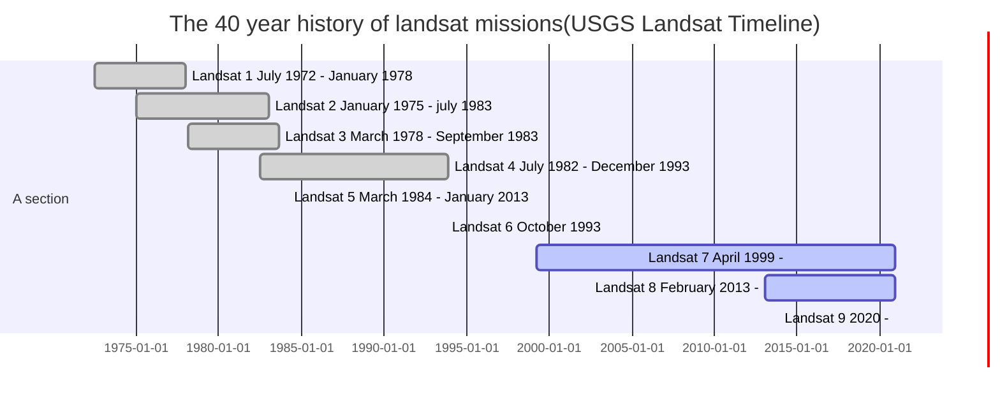

协方差，covariance matrix

multiregression, the atribution degree by each feature

```mermaid
gantt

dateFormat  YYYY-MM
title The 40 year history of landsat missions(USGS Landsat Timeline)
excludes weekdays 2014-01-10

section A section
Landsat 1 July 1972 - January 1978            :done,    des1, 1972-07,1978-01
Landsat 2 January 1975 - july 1983            :done,    des1, 1975-01,1983-01
Landsat 3 March 1978 - September 1983         :done,    des1, 1978-03,1983-09
Landsat 4 July 1982 - December 1993           :done,    des1, 1982-07,1993-12
Landsat 5 March 1984 - January 2013           :done,    des1, 1984-03,2013-1
Landsat 6 October 1993                        :done,    des1, 1993-10,1993-10
Landsat 7 April 1999 -                        :active,    des1, 1999-04,2020-12
Landsat 8 February 2013 -                     :active,    des1, 2013-02,2020-12
Landsat 9 2020 -                              :         des1, 2020-12,2020-12
```

